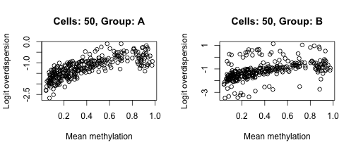
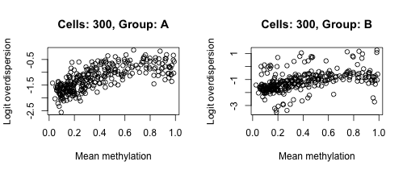

<!-- Load modules -->


<!-- Load settings -->


## Define data options

```r
N_feat <- 300
N_cpgs <- 15
# N_cells <- c(20, 35, 50, 100, 200, 300)
# N_cells <- c("50","100","200","300")
N_cells <- c("50","100","300")

models <- c("MCMC","VB")
groups <- c("A","B")
```

## Load pre-computed models


```r
models_list <- list()
models_list[["MCMC"]] <- list()
models_list[["VB"]] <- list()

for (i in N_cells) {
  file <- paste0(io$data_dir, "bbreg_feat", N_feat, "_cells", i, "_cpgs", N_cpgs,"_mcmcTRUE.rds")
  models_list[["MCMC"]][[i]] <- readRDS(file)
  
  file <- paste0(io$data_dir, "bbreg_feat", N_feat, "_cells", i, "_cpgs", N_cpgs,"_mcmcFALSE.rds")
  models_list[["VB"]][[i]] <- readRDS(file)
}
```

## Plot mean vs overdispersion for the true data

